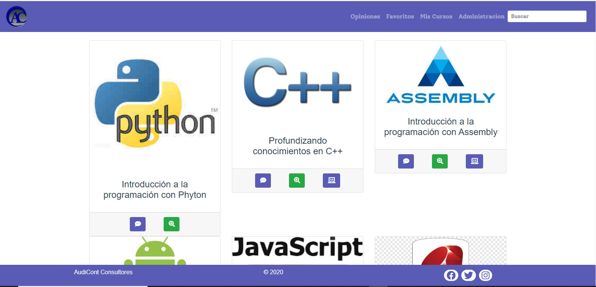
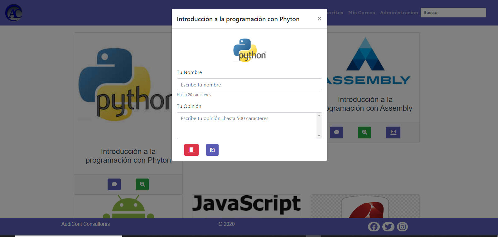
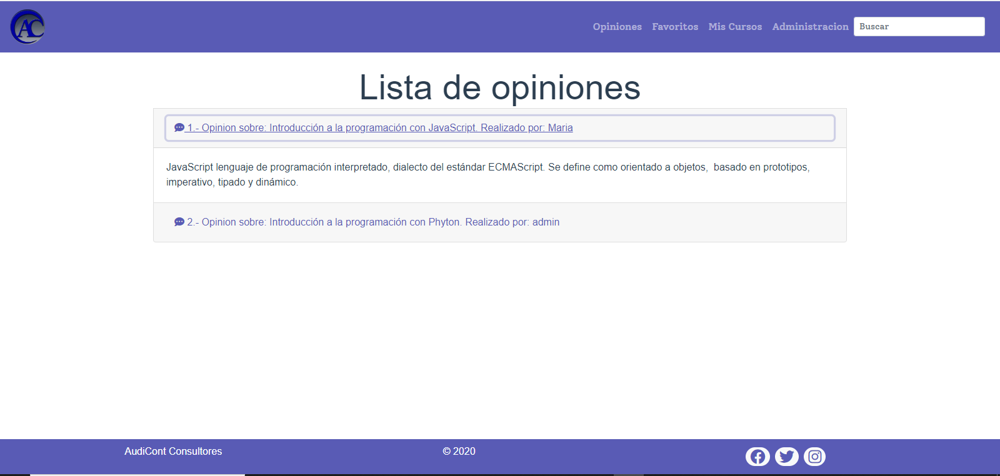
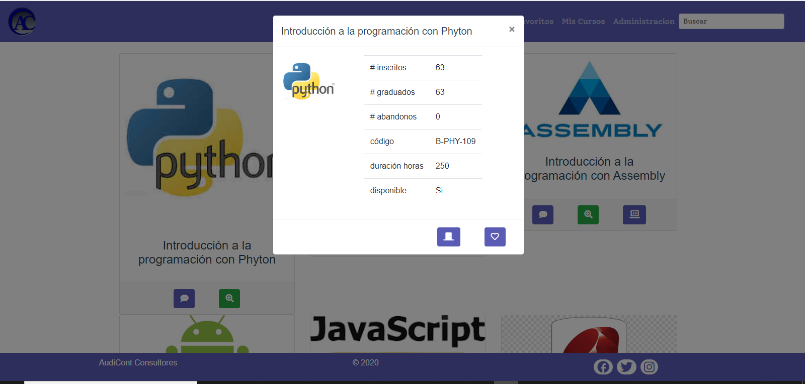
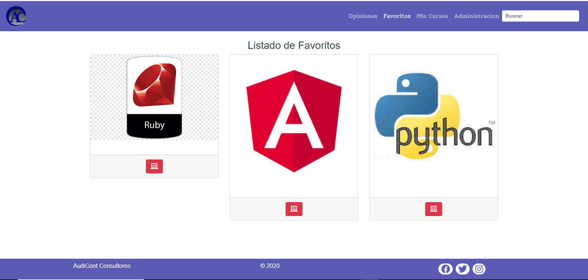
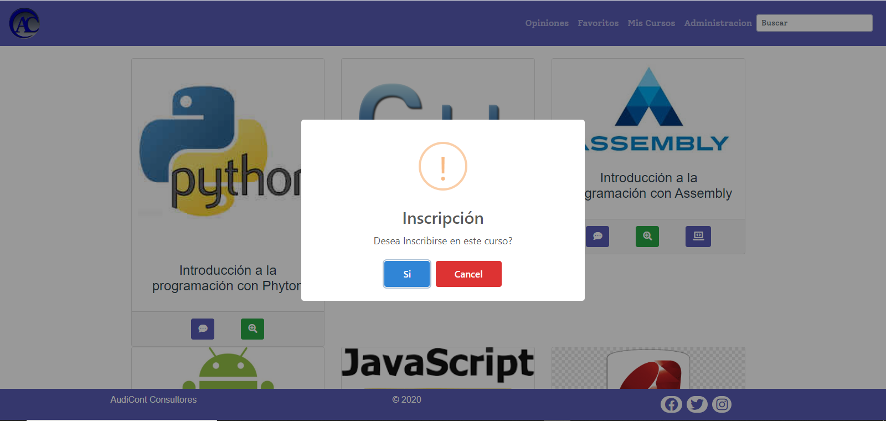
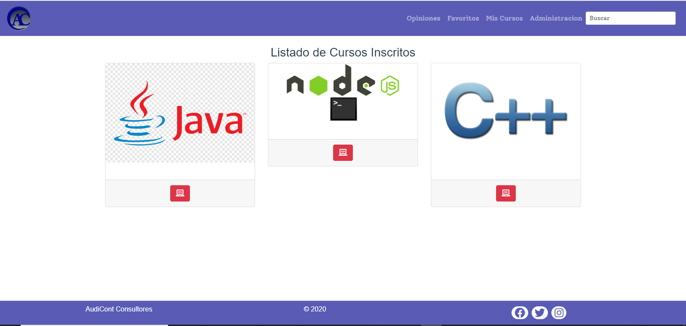
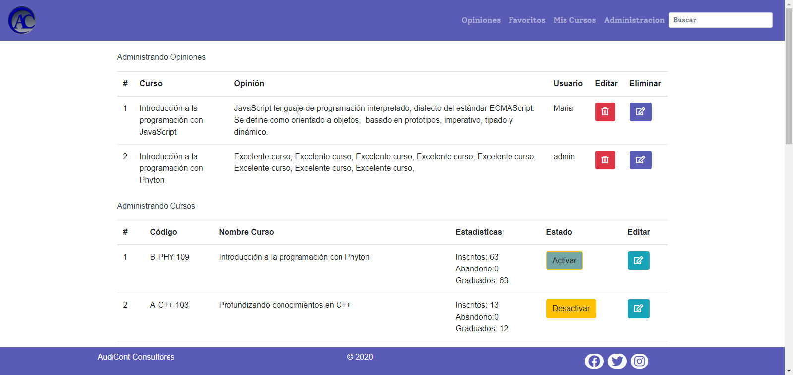
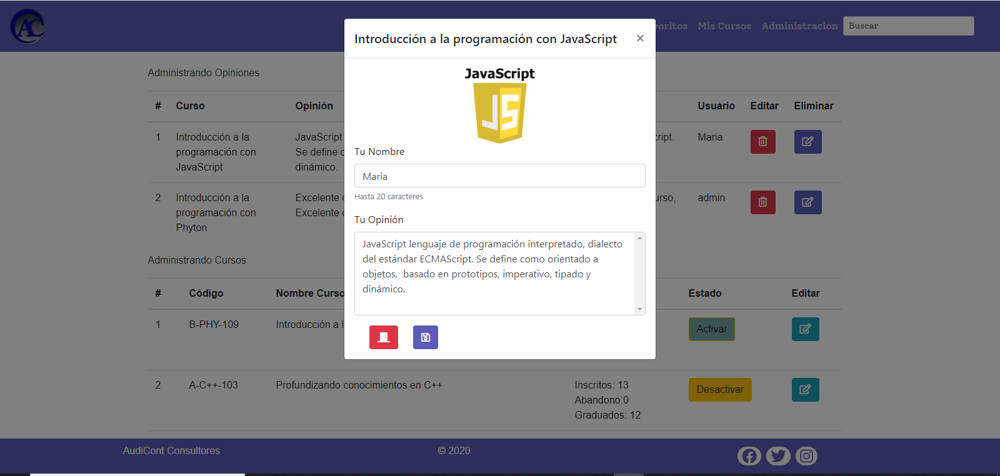
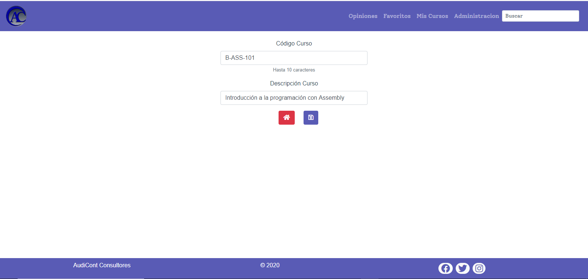

# prueba1ensayo3 simulación cursos  AudiCont Consultores 

## Project setup
```
yarn install
```

### Compiles and hot-reloads for development
```
yarn serve
```

### Compiles and minifies for production
```
yarn build
```

### Lints and fixes files
```
yarn lint
```

### Customize configuration
See [Configuration Reference](https://cli.vuejs.org/config/).


# Enunciado
Una academia de cursos en línea, solicita realizar una página web en donde sus
usuarios puedan interactuar con los cursos ofrecidos por la empresa, por ende,
pondrá a disposición de sus lectores una aplicación web responsiva para que los
usuarios acceden a la lista de cursos disponibles. En la vista principal(home) , los
usuarios podrán ver los cursos con los que cuenta la empresa, igualmente en la
vista principal, los usuarios podrán acceder a tres opciones (botones), las dos
primeros botones se mostrarán en ventanas emergentes. El diseño de la vista
principal podría ser:
### Vista Principal

El primer botón es para realizar una opinión sobre el curso, por ende, en la ventana
emergente el usuario podrá agregar su nombre y opinión, luego decidir si guardar la
información suministrada (debe existir información para poder guardar), o cerrar la
ventana. Venta modal para opinar:
### Modal Opinar

En el caso que guarde la información, automáticamente se debe redirigir a la vista
de opiniones para mostrar las opiniones que estén disponibles o guardadas. En la
vista de opinión se mostrarán las opiniones que cualquier usuario haya realizado
(utiliza Collapse de bootstrap para mostrar las opiniones). Vista de opiniones con
datos existentes:
### Vista Opiniones

El segundo es un botón de “ver más”, donde se mostrará información más completa
del curso (cantidad de alumnos inscritos, abandonos, finalizados, código, tiempo o
duración del curso, nombre completo del curso, imagen, y si se encuentra disponible
o no el curso para inscribir), luego podrá cerrar la ventana y volver a la página inicial
o agregar a favoritos (si agrega a favoritos se debe redirigir automáticamente a la
vista de favoritos). Venta modal para ver más:
### Modal VerMas

En la vista de favoritos se mostrarán los cursos que estén agregados como
favoritos, igualmente se podrán eliminar de la lista (no hace falta redireccionar a
ninguna otra vista). Si no existen curso por mostrar en favoritos, se debe indicar con
un mensaje que no existen cursos. Vista de favoritos con datos existentes:
### misfavoritos

El tercer boton, sera un botón que permita a un usuario inscribirse en un curso que
esté disponible. Este botón debe estar disponible (activo) solo si el curso se
encuentra disponible, es decir, si está finalizado el curso el botón debe estar
desactivado o no se debe mostrar, queda a su elección. Al hacer un clic sobre el
botón, debe aparecer un mensaje indicando que se inscribió en el curso utilizando la
librería de Sweetalert2 , y no debe enviar a ningún otra vista. También, cuando el alumno 
se inscribe en el curso, el número de inscritos debe aumentar automáticamente.
### inscripción a un curso

Existirá una vista de Cursos Inscritos , en donde el alumno podrá ver los cursos que
tenga inscritos en ese momento. En esta vista solo existirá la opción de darse de
baja del curso. Si el alumno se da de baja, el número de inscritos debe disminuir y el
número de abandono debe aumentar para ese curso. Si no hay cursos inscritos, se
debe indicar un mensaje que no existen cursos para mostrar. Vista de cursos
inscritos con datos existentes:
### Mis cursos inscritos

En la vista de administración, se debe solicitar una clave para poder mostrar la
información cada vez que se haga un clic sobre la vista (esto lo hacen de forma
local y sencilla, comparando los datos ingresados con una variable local en la store),
pueden implementar Sweetalert2 o utilizar una modal de Boostrarp que se active
cada vez que se carga la vista con jquery (en clases se hizo un ejemplo de eso). Si
la clave no es la correcta, se debe redirigir el usuario a la vista principal. En el caso
de ser correcta, se deben mostrar los datos.

En esta vista de administración deben existir dos tablas separadas, una tabla para
administrar las opiniones con los datos de opinión, autor y curso, con dos opciones
disponibles mediante botones (eliminar y editar). La opción de eliminar debe
hacerse con una ventana modal para ejecutar un alerta y el usuario confirme,
mientras que la opción de editar, debe llevar al usuario a una vista separada,
permitiendo modificar el comentario y el nombre del usuario. Esta vista de editar
debe tener dos opciones, una de regresar y otra de guardar, ambas, al ejecutarse
deben dirigir al usuario a la vista de administración. Ahora, si no existen datos para
mostrar, en la tabla de opiniones, se debe indicar que aún no hay opiniones por
administrar.

La segunda tabla debe ser para administrar los cursos. Es decir, en esta tabla
deben estar todos los cursos, con la cantidad de alumnos inscritos, los que
finalizaron y los que abandonaron. Al igual que el nombre del curso y el código.
También debe existir un botón que permita finalizar o activar el curso, es decir, si el
curso no se encuentra disponible el administrador podrá activar el curso para que
los alumnos se puedan inscribir. Si el administrador desactiva un curso, todos los
alumnos inscritos deberán pasar a finalizados, dejando en cero los inscritos y
sumando en los finalizados. Vista de administración con datos existentes:
### Tablas Administración 

### Editar Opinión

### Editar Curso


## Se Requiere

* Se solicita una vista principal (“/”) con una grilla de cards usando Bootstrap
* La API a utilizar es la creada por Javiera, Rodrigo y Miguel: “Cursos
JaRoMI - 2020 ”, la dirección exacta con la que deben trabajar es:
https://us-central1-apiclub-d7567.cloudfunctions.net/apiClub/cursos . No
requiere registrarse y/o solicitar API_KEY. Importante, la API se debe traer
la información una sola vez, nada mas, despues no puede traer mas
información hasta que se reinicie o recargue la página por completo e
inicie el ciclo nuevamente. Apoyate con una variable que permita hacer el
llamado una sola vez, es decir, que mute cuando se haga el llamado y no
lo haga nuevamente.
* En las vistas de Favoritos, Opiniones, Cursos Inscritos y Administración, si
no existe ningún valor para mostrar, debe aparecer el mensaje indicando
la situación, tal cual como se muestra en las maquetas.
* La vista de administración debe contener dos tablas separadas y
responsiva.
* Un usuario al inscribirse en un curso, no debe registrar identificación
alguna, ya que no estamos trabajando con sesiones de usuario.
* En vista cursos inscritos se deben mostrar todos los cursos que estén
como inscritos (como no tenemos base de datos ni LocalStorage),
entonces serán los que se inscriban en ese preciso momento.
* En la vista de administración, si se finaliza un curso los usuarios inscritos
en ese curso se eliminan (pasa a cero) y pasan a ser parte de los
egresados, por consiguiente, el curso ya no debe estar en la vista de
cursos inscritos. Y en la vista principal (ojo, si no se ha actualizado la
página...), el curso no debería tener usuarios inscritos y el número de
egresados debería aumentar. Esto parte del supuesto que el curso finalizó
y todos se graduaron. Recuerden, no tenemos base de datos, por eso los
supuestos un poco fuera de la realidad.
* En la vista cursos inscritos, si un usuario se da de baja en el curso inscrito,
se debe eliminar ese curso de la vista de inscritos, y restar ese usuario a
los inscritos en ese curso y sumar a los abandonos de ese curso.
* El botón en la vista de administración de la tabla de cursos denominado
Activar/finalizar, debe tener un comportamiento 'toggle', atachado al valor
booleano de finalizado del curso. Es decir, mostrar el texto Activar si es
que se puede activar el curso, o Desactivar si es que puede desactivar.
* Recuerden que si se reinicia la página, se pierde todo y vuelve a su
estado inicial.

## Casos de uso
* 1 Crea un proyecto con Vue Cli
* 2 Instalar y configurar bootstrap, popper, axios, jquery, sass.
* 3 Personalizar las variables de bootstrap
* 4 Agregar los metatags en el index.html de la carpeta public
* 5 Crear componente de navegación utilizando bootstrap con acceso a un panel de
administración y a la vista principal de artículos
* 6 Configurar el Vuex con datos de artículos iniciales en el estado (state) con una variable
(arreglo) que contenga: código, url de imagen, nombre, inscritos, abandonos,
finalizados, activo, duration, entre otros.
* 7 Crear vista de index de cursos mostrando los cursos cómo cards de bootstrap
mediante la utilización de propiedades computadas con los getters del Vuex
* 8 Configurar ruta de inicio a index de los cursos
* 9 Configurar ruta 404
* 10 Crear una ruta para un panel de administración
* 11 Crear la vista del panel de administración con las dos tabla, una para opiniones y otra
para los cursos en general.
* 12 El botón de favoritos y opiniones que se encuentra en la vista principal, debe
redireccionar a la vista correspondiente en el caso de guardar en favorito o crear una
opinión. Por otra parte, estos botones al crear un favorito o una opinión, deben poseer
acciones de Vuex para modificar la variable del estado perteneciente a los cursos
favoritos y a las opiniones por curso respectivamente.
* 13 El formulario de crear una opinión debe tener todos los estilos de bootstrap tanto en
los labels, campos y botones
* 14 Validar que los campos del formulario de agregar una nueva opinión donde todos los
campos estén presentes. Que el contenido tenga más de 20 caracteres y el nombre
más de 3 caracteres.
* 15 Crear un archivo JS de configuración para solicitar la información de la API
https://us-central1-apiclub-d7567.cloudfunctions.net/apiClub/cursos mediante el
metodo get con axios o fetch, el cual debe ser exportado como módulo de ES6.
realizar el llamado una sola vez por carga o reinicio de página.
* 16 Utilizar (importar) el módulo de JS en el ciclo de vida de un componente para traer la
información de la API.
* 17 Enviar a Vuex mediante acciones la información recibida de la API.
* 18 Mutar la variable (arreglo) creada en el estado (state) con los nuevos datos recibidos
de la API
* 19 Revisar código e indentar y comentar acorde a buenas prácticas
* 20 Modificar el color del Hover de la tabla creada mediante el uso de cascada y nesting
con SASS, sobreescribiendo cualquier clase existente de bootstrap respetando las
convenciones BEM.
* 21 Implementar un filtro (buscador) en la vista donde se muestran todos los articulos para
buscar por nombre de curso o código de curso, y se vayan mostrando las
coincidencias.
* 22 Agregar un botón a la tabla de cursos que permita activar o desactivar los cursos,
dependiendo del estado original con el que llegan de la API. Este botón debe cambiar
el texto indicativo, “Activar” si se puede activar o “Desactivar” si se puede suspender el
curso.
* 23 Publicar el proyecto final en cualquier repositorio web que muestra la página o
producto ya finalizado. (Firebase, Github, Heroku, Netlify, o hosting personal).

